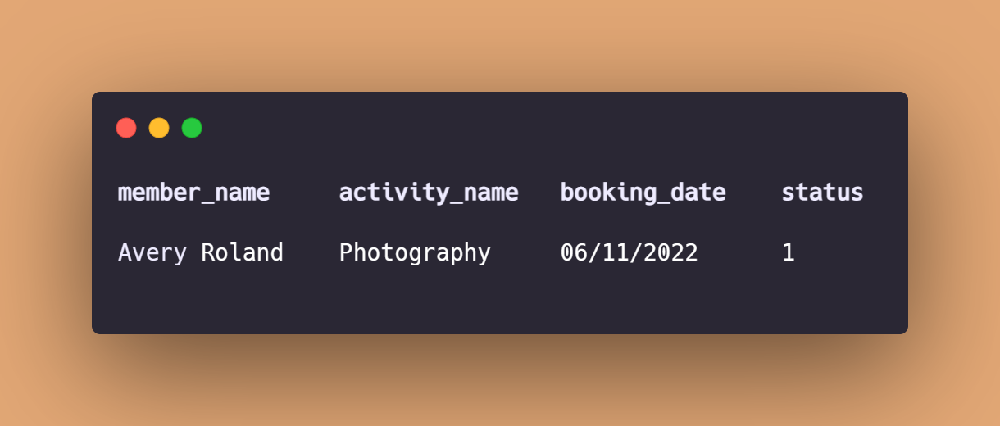
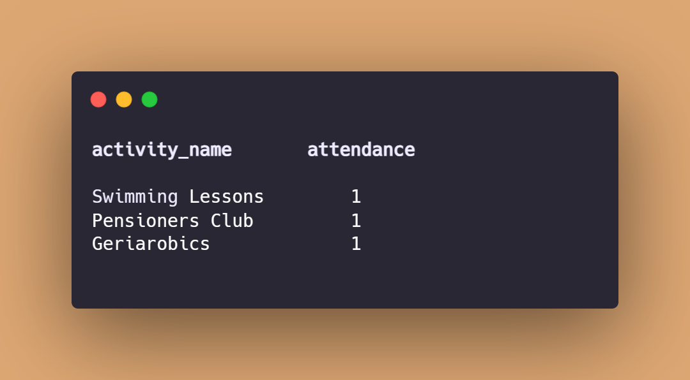

# Luton_Community_Centre_Activities_Database_Analysis_with_Postgresql

## Introduction
The purpose of this project is to re-assess my knowledge of the use of Postgresql. The work done is to build a database for a fictitious public community centre, that takes a record of all activities taken place at the community centre both paid and free services, with the category of individuals that can participate in each activity. The project concludes by asking some predictable live questions that are answered through queries.

## Problem Statement
In this project, data manipulation will be done to answer the set objectives, this includes:

- Get the members names who attended the “Photography Activity” on November 6th 2022.
- Check if Giulietta Nathan, Paul Lucas, and Chris John attended on November 8th, 2022.
- Get the room no for the activity A118.
- Which activity has the least attendance?
- Get the membership cost of all the activities.

## Data Source
Data was scraped from Kaggle, and downloaded as CSV file. Then manually transformed with Excel into the needed type of data that suits the analysis question.

## Data Transformation
- This project made use of Postgresql to create 4 tables with correct data types using query method.
- And likewise insert data into the table though codes (query method).

## Data Manipulation:

- ### Members list for photography attendance on November 6th, 2022.

This query is to fetch the members who attended the photography activity on November 6th, 2022.
Three tables are used namely activity_booking_detail, activity_detail, and member_detail.

Query                                              | Output
---------------------------------------------------|---------------------------------------------------
   | 

- ### Check of Guiletta Nathan, Paul Lucas, Chris John attendance on November 8th, 2022.

This query is used to check if Giulietta Nathan, Paul Lucas and Chris John were present on November 8th, 2022.
Three tables are used namely; activity_booking_detail, activity_detail and member_detail.

Query                                              | Output
---------------------------------------------------|---------------------------------------------------
               | 

- ### Room Number for Activity A118

This query is used to get the Room number for activity "A118".
Two tables are used namely, Activity_Detail and Room_Detail.

Query                                           | Output
------------------------------------------------|-----------------------------------------------
    | 

- ### Activity with the least attendance
  
This query calls all the activities at the community centre and returns the activity with the lowest attendance.
It includes a.Activity_Name, COUNT(ab.Activity_Id), ab.Activity_Id, Status  

Query                                          | Output
-----------------------------------------------|------------------------------------------------
  | 

- ### Membership cost of activities.
  
This query helps to check the cost of all the activities taking place in the community centre for decision making. 
It includes Adult_Membership_Cost, Child_Membership_Cost, Activity_Name  

Query                                          | Output
-----------------------------------------------|------------------------------------------------
   | 

## Skills Demonstrated
- Data Cleaning.
- Data analysis
- Data manipulation.
- Data wrangling.

Thank you for your time.🤝
